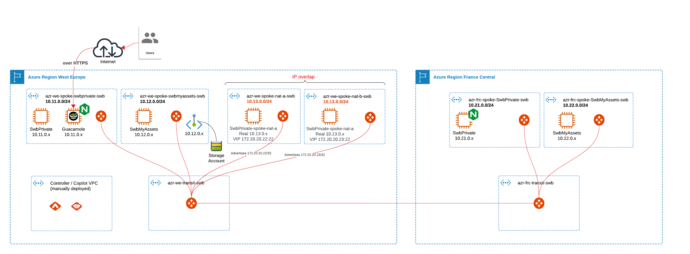

# SWB Demo
All artifacts for demo.

# Context

For that demo, we need :

- An Aviatrix Controller and Copilot deployed in a dedicated vnet.

- Aviatrix transit deployed in two Azure regions :
  - First transit in West Europe named we in the code,
  - Second transit in France Central named frc in the code,
  - Standard peering between those two regions over Azure backbone.

- Aviatrix spoke deployed in each of the above region :
  - Two vnets, each with an Aviatrix spoke in first region,
  - Two vnets with overlapping CIDRs, each with an Aviatrix spoke in first region,
  - Two vnets, each with an Aviatrix spoke in second region,
  - Each spoke is peered with its regional transit.
  - Each spoke contains a test VM instance accessible via Guacamole jumpbox
  - Guacamole server is deployed in the first spoke of the first region. (Search for the URL to connect in the output after terraform deployment)
  - Guacamole server is also used as a reverse proxy (NGINX) to connect to first application in opposite region across Aviatrix transit.

Diagram of the overall architecture :

# Requirement

- At least one Azure subscription,
- An account being able to create SPN,
- Subscribe to Aviatrix offers :
  - [Aviatrix Secure Cloud Networking (Includes Free Trial)](https://portal.azure.com/#create/aviatrix-systems.aviatrix-controller-abu-saas) 
  - [Azure Marketplace: Aviatrix Secure Networking Platform - BYOL](https://portal.azure.com/#create/aviatrix-systems.aviatrix-bundle-payg)
  - [Azure Marketplace: Aviatrix CoPilot](https://portal.azure.com/#create/aviatrix-systems.aviatrix-copilot)
  
- Follow the doc to deploy controller and copilot
  - [Getting started Azure](https://docs.aviatrix.com/documentation/latest/getting-started/getting-started-guide-azure.html)
- A workstation that:
  - can access to terraform website,
  - can access the newly deployed controller / copilot public IP address,
  - can access github.com to clone this repository,
  - can execute terraform code.
- A terraform.tfvars containing values like in terraform.tfvars.sample
  
# Assumptions

- For fast deploy, we assume demo is deployed as NON highly available. This can be changed easily by updating terraform code
- We deploy Controller and Copilot is same region as first transit in a dedicated vnet

# Scenario in this demo

## Test inbound connectivity from to internet
- NGINX is configured as a reverse proxy in first region to NGINX in second region.
- Test:
  - Browse Guacamole IP using https://w.x.y.z/app
  - Look at NGINX announcement

## Demo overlapping IP accross spoke. Kubernetes "cookie-cutter" deployment usecase
- Two spokes deployed in first region using same CIDR block.
- Each advertise a unique ip 172.20.20.22/32 and 172.20.20.23/32
- Test:
  - connect via Guacamole to we-SwbPrivate-nat-a and "ip a"
  - connect via Guacamole to we-SwbPrivate-nat-b and "ip a"

## Private Endpoint connectivity test across Aviatrix Data Plane
- Private endpoint deployed in first region, second spoke
- Connected using Linux SBM Client in first region, first spoke
- Test: 
  - connect via Guacamole to we-SwbPrivate
  - df -h, 
  - ls /mnt/azrweswbsa